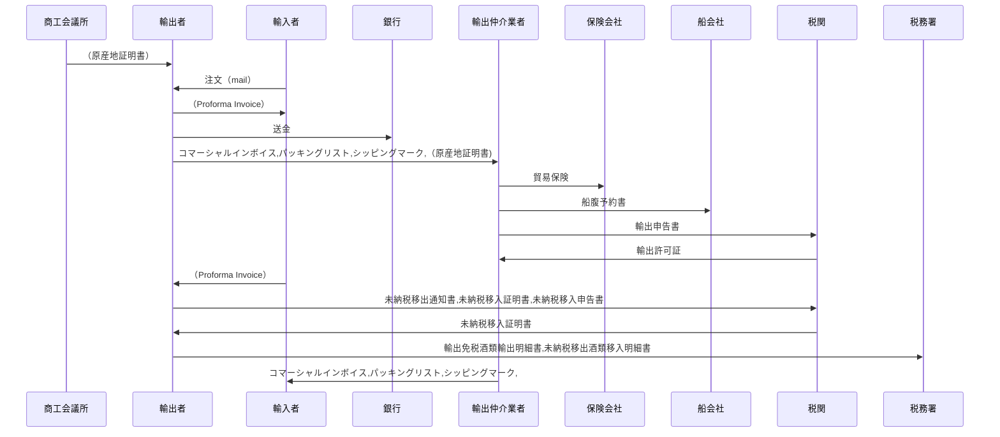

### 概要

### 業務の流れ

|     | 関係者（組織または個人） | 帳票物                                                                   |
| --- | ------------------------ | ------------------------------------------------------------------------ |
| 1   | 商工会議所->>輸出者      | （原産地証明書）                                                         |
| 2   | 輸入者->>輸出者          | 注文（mail）                                                             |
| 3   | 輸出者->>輸入者          | （Proforma Invoice）                                                     |
| 4   | 輸出者->>銀行            | 送金                                                                     |
| 5   | 輸出者->>輸出仲介業者    | コマーシャルインボイス,パッキングリスト,シッピングマーク,（原産地証明書) |
| 6   | 輸出仲介業者->>保険会社  | 貿易保険                                                                 |
| 7   | 輸出仲介業者->>船会社    | 船腹予約書                                                               |
| 8   | 輸出仲介業者->>税関      | 輸出申告書                                                               |
| 9   | 税関->>輸出仲介業者      | 輸出許可証                                                               |
| 10  | 輸入者->>輸出者          | （Proforma Invoice）                                                     |
| 11  | 輸出者->>税関            | 未納税移出通知書,未納税移入証明書,未納税移入申告書                       |
| 12  | 税関->>輸出者            | 未納税移入証明書                                                         |
| 13  | 輸出者->>税務署          | 輸出免税酒類輸出明細書,未納税移出酒類移入明細書                          |
| 14  | 輸出仲介業者->>輸入者    | コマーシャルインボイス,パッキングリスト,シッピングマーク,                |

import Carousel from "../../components/carousel.astro";
export const carouselPages = [
  {
    name: "Cowarra Dam",
    image: "../images/gallery/carousel/commercialInvoice.png",
    title: "コマーシャルインボイス",
    description: "コマーシャルインボイス",
  },
  {
    name: "Mayfield Garden",
    image: "../images/gallery/carousel/packinglist.png",
    title: "パッキングリスト",
    description: "パッキングリスト",
  },
  {
    name: "Mt Tomah",
    image: "../images/gallery/carousel/shippingmark.png",
    title: "シッピングマーク",
    description: "シッピングマーク",
  },
];

## 機能

<Carousel pages={carouselPages} />
