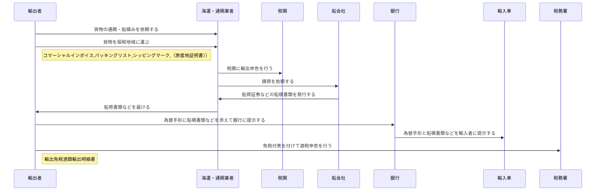

## 目次
 - 概要
 - 業務の流れ
 - システムの使い方 
## 概要
直接輸出を行う際に、以下の機能を使用することができます。

 - **コマーシャルインボイス**：  
 貨物の品名、数量、価格、支払条件、買主名、売主名などを記載した書類で、請求書や課税価格の計算に使われます。
 - **パッキングリスト**：  
 貨物の個数、重量、容積などを記載した書類で、仕入書を補完するものです。税関や通関業者から提出を求められることがあります。
 - **シッピングマーク**：  
 貨物の外側に表示される記号や文字で、荷主名、荷受人名、目的地、品名、数量などを示します。荷物の識別や取り扱いに役立ちます。

酒税申告を行う際には、以下の機能を使用することができます。
 - **輸出免税酒類輸出明細書**：  
酒類製造者が酒類を外国に輸出する目的で製造場から移出する場合に、酒税が免除されるための手続きの一環として作成する書類です。輸出した酒類の税率の適用区分、数量、輸出の年月日、仕向地、輸出港の所轄税関などの事項を記載します。また、輸出許可証等に基づいて作成されたものであることを証明する必要があります13。令和２年４月１日以後に提出期限が到来する納税申告書より、輸出免税酒類輸出明細書の添付は不要となりましたが、帳簿に必要な事項を記載し、保存する必要があります

## 業務の流れ
#### 直接輸出の例

|      | 関係者（組織または個人） | 活動                                         | 帳票物                                                   |
| ---- | ------------------------ | -------------------------------------------- | -------------------------------------------------------- |
| 1    | 輸出者->>海運・通関業者  | 貨物の通関・船積みを依頼する                 |                                    |
| 2    | 輸出者->>海運・通関業者  | 貨物を保税地域に運ぶ                         | コマーシャルインボイス,パッキングリスト,シッピングマーク |
| 3    | 海運・通関業者->>税関    | 税関に輸出申告を行う                         |                                                          |
| 4    | 海運・通関業者->>船会社  | 積荷を依頼する                               |                                                          |
| 5    | 船会社->>海運・通関業者  | 船荷証券などの船積書類を発行する             |                                                          |
| 6    | 海運・通関業者->>輸出者  | 船荷書類などを届ける                         |                                                          |
| 7    | 輸出者->>銀行            | 為替手形に船積書類などを添えて銀行に提示する |                                                          |
| 8    | 銀行->>輸入車            | 為替手形と船積書類などを輸入者に提示する     |                                                          |
| 9    | 輸出者->>税務署          | 免税付表を付けて酒税申告を行う               | 輸出免税酒類輸出明細書                                   |

## システムの使い方
### サンプルイメージ
import Carousel from '../../components/carousel.astro'
export const carouselPages = [
  { name: 'Cowarra Dam', image: '../images/gallery/carousel/commercialInvoice.png', title: 'コマーシャルインボイス', description: 'コマーシャルインボイス' },
  { name: 'Mayfield Garden', image: '../images/gallery/carousel/packinglist.png', title: 'パッキングリスト', description: 'パッキングリスト' },
  { name: 'Mt Tomah', image: '../images/gallery/carousel/shippingmark.png', title: 'シッピングマーク', description: 'シッピングマーク' },
]

<Carousel pages={carouselPages} />

### 入力方法
**受注入力**  

受注入力で以下の情報を登録します。
 - 取引：101:輸出売上
 - 輸出国情報：仕向地、所轄税関

 メニュー>受注入力>登録または修正を実行します。  
 入力１タブで、明細欄の取引に `101:輸出売上` を指定します。
 </img>
 入力２タブで、輸出国情報から仕向地と所轄税関を指定します。
 </img>
 その他、必要な情報を入力して確定します。

**輸出帳票事前準備**  

輸出帳票事前準備で、先ほど登録した受注入力データに詳細な貨物の情報を登録します。
</img>
入力番号欄で、検索を実行します。表示された受注入力データを選択して、OKボタンを押します。
</img>
基本情報タブで、インボイス情報、輸出情報、荷物・支払い情報を入力します。
</img>
パレット情報タブで、パレット情報を入力します。
</img>

**コマーシャルインボイス,パッキングリスト,シッピングマーク**  

メニューからコマーシャルインボイス,パッキングリスト,シッピングマークを選択し、実行します。
</img>
</img>
</img>
</img>

以上で輸出帳票の作成は完了です。