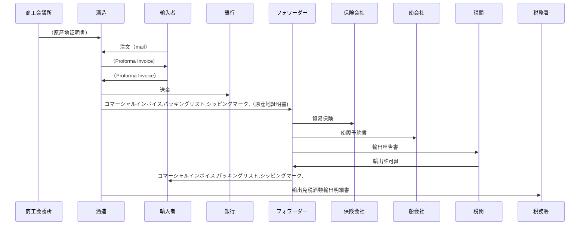

## 目次
 - 概要
 - 業務の流れ
 - システムの使い方 
### 概要
直接輸出を行う際に、以下の機能を使用することができます。

 - **コマーシャルインボイス**：  
 貨物の品名、数量、価格、支払条件、買主名、売主名などを記載した書類で、請求書や課税価格の計算に使われます。
 - **パッキングリスト**：  
 貨物の個数、重量、容積などを記載した書類で、仕入書を補完するものです。税関や通関業者から提出を求められることがあります。
 - **シッピングマーク**：  
 貨物の外側に表示される記号や文字で、荷主名、荷受人名、目的地、品名、数量などを示します。荷物の識別や取り扱いに役立ちます。

酒税申告を行う際には、以下の機能を使用することができます。
 - **輸出免税酒類輸出明細書**：  
酒類製造者が酒類を外国に輸出する目的で製造場から移出する場合に、酒税が免除されるための手続きの一環として作成する書類です。輸出した酒類の税率の適用区分、数量、輸出の年月日、仕向地、輸出港の所轄税関などの事項を記載します。また、輸出許可証等に基づいて作成されたものであることを証明する必要があります13。令和２年４月１日以後に提出期限が到来する納税申告書より、輸出免税酒類輸出明細書の添付は不要となりましたが、帳簿に必要な事項を記載し、保存する必要があります

### 業務の流れ
#### 直接輸出の例

|      | 関係者（組織または個人）                | 帳票物                                                       |
| ---- | ----------------------- | ------------------------------------------------------------ |
| 1    | 商工会議所->>酒造     | （原産地証明書）                                             |
| 2    | 輸入者->>酒造         | 注文（mail）                                                 |
| 3    | 酒造->>輸入者         | （Proforma Invoice）                                         |
| 4   | 輸入者->>酒造         | （Proforma Invoice）                                         |
| 5    | 酒造->>銀行           | 送金                                                         |
| 6    | 酒造->>フォワーダー   | <b style={{color: 'tomato'}}>コマーシャルインボイス,パッキングリスト,シッピングマーク</b>（原産地証明書) |
| 7    | フォワーダー->>保険会社 | 貿易保険                                                     |
| 8    | フォワーダー->>船会社   | 船腹予約書                                                   |
| 9    | フォワーダー->>税関     | 輸出申告書                                                   |
| 10    | 税関->>フォワーダー者     | 輸出許可証                                                   |
| 11   | 輸入者->>酒造         | （Proforma Invoice）                                         |
| 12   |	フォワーダー->>輸入者 |コマーシャルインボイス,パッキングリスト,シッピングマーク,              |
| 13   | 酒造->>税務署         | <b style={{color: 'tomato'}}>輸出免税酒類輸出明細書</b>              |

### システムの使い方
#### サンプルイメージ
import Carousel from '../../components/carousel.astro'
export const carouselPages = [
  { name: 'Cowarra Dam', image: '../images/gallery/carousel/commercialInvoice.png', title: 'コマーシャルインボイス', description: 'コマーシャルインボイス' },
  { name: 'Mayfield Garden', image: '../images/gallery/carousel/packinglist.png', title: 'パッキングリスト', description: 'パッキングリスト' },
  { name: 'Mt Tomah', image: '../images/gallery/carousel/shippingmark.png', title: 'シッピングマーク', description: 'シッピングマーク' },
]

<Carousel pages={carouselPages} />