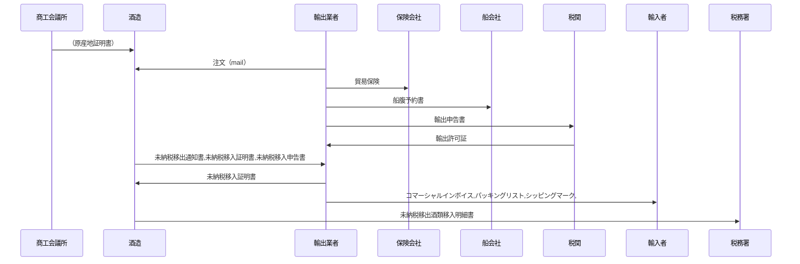

## 目次
 - 概要
 - 業務の流れ
 - システムの使い方 
### 概要
間接輸出を行う際に、以下の機能を使用することができます。

 - **未納税移出通知書**：  
 未納税酒類の移出者が、移出した日ごとに移入者に送付する書類です。移出者の住所や氏名、移出製造場等の所在地や名称、移出した酒類の品目や数量などを記載します。
 - **未納税移入証明書**：  
 未納税酒類の移入者が、移出者から送付された未納税移出通知書に基づいて作成し、移出者に送付する書類です。移入者の住所や氏名、移入製造場等の所在地や名称、移入した酒類の品目や数量などを記載します1。
 - **未納税移入申告書**：  
 未納税酒類の移入者が、移出者から送付された未納税移出通知書に基づいて作成し、所轄税務署長に提出する書類です。未納税移入証明書と同様の内容を記載します

この際、酒税申告を行う際に、以下の機能を使用することができます。
 - **未納税移出酒類移入明細書**：  
 同一製造者の製造場等間の未納税移出入である場合に、移入申告書として用いることができる書類です。未納税移出入事績を酒類の品目別等、その他の区分の別、輸送容器の種類及び個数の別、数量の別に記載します。また、未納税移出酒類移入明細書を納税申告書の提出期限から3か月を経過した日以後に提出することを予定している場合は、提出期限の延長を所轄税務署長に申請する必要があります。

### 業務の流れ
#### 間接輸出の例

|      | 関係者（組織または個人）                | 帳票物                                                       |
| ---- | ----------------------- | ------------------------------------------------------------ |
| 1    | 商工会議所->>酒造     | （原産地証明書）                                             |
| 2    | 輸出業者->>酒造         | 注文（mail）                                                 |
| 6    | 輸出業者->>保険会社 | 貿易保険                                                     |
| 7    | 輸出業者->>船会社   | 船腹予約書                                                   |
| 8    | 輸出業者->>税関     | 輸出申告書                                                   |
| 9    | 税関->>輸出業者     | 輸出許可証                                                   |
| 11   | 酒造->>輸出業者           | <b style={{color: 'tomato'}}>未納税移出通知書,未納税移入証明書,未納税移入申告書</b>           |
| 12   | 輸出業者->>酒造           | <b style={{color: 'tomato'}}>未納税移入証明書</b>                                             |
| 13   | 輸出業者->>輸入者   | コマーシャルインボイス,パッキングリスト,シッピングマーク   |
| 14   | 酒造->>税務署         | <b style={{color: 'tomato'}}>未納税移出酒類移入明細書</b>              |

### サンプルイメージ
