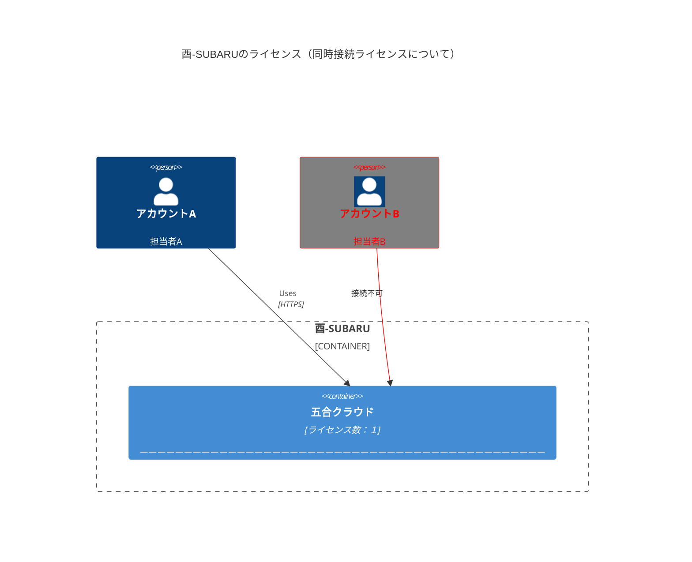
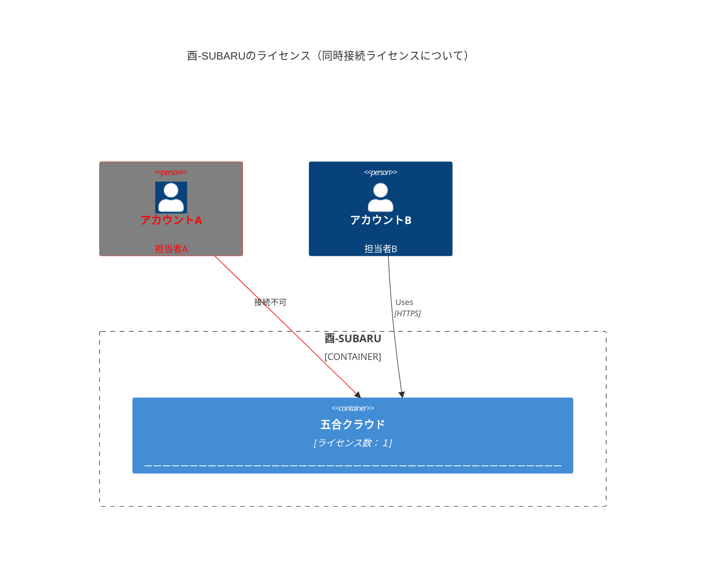
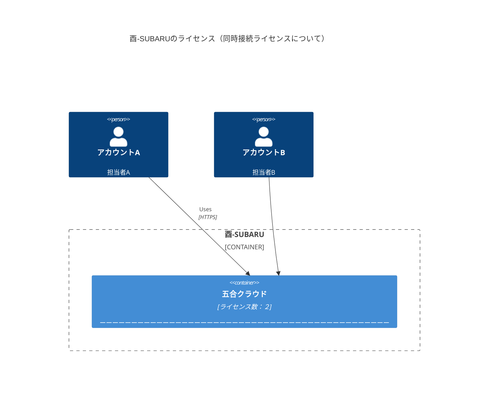

## ライセンスの考え方
ライセンスは、同時に利用する人数分のライセンスをご契約いただきます。  
- 例えば、３ライセンスの場合は、３人が同時に利用できます。  
- 1人がタブレットや自宅用PCなど複数台の端末から同時に接続しても、消費されるライセンス数は１つとなります。

### 例）契約しているライセンス数が１つの場合
- アカウントAとアカウントBは同時に利用できません。
- 後からログインしたアカウントBは、自動ログアウトされます。
- アカウントAは利用し続けることができます。

- 先にアカウントBがログインしていた場合、後からログインしたアカウントAは自動ログアウトされます。
- アカウントBは利用し続けることができます。

### 例）契約しているライセンス数が２つの場合
- アカウントAとアカウントBは同時に利用できます。

