# 五合クラウドの概要
デジタルトランスフォーメーション（DX）は、今後の業務システムにおいて不可欠な要素となっています。手作業や紙ベースの作業をデジタル化することで、効率性が飛躍的に向上し、エラーのリスクを大幅に削減します。さらに、データ分析を活用することで、ビジネスの成長を加速させる新たな可能性が広がります。 

このようなDXの観点から、酉-SUBARUは「五合」が生まれ変わるという新しいビジョンを体現するシステムとして、酒税申告と在庫管理に特化した効率的なツールを提供します。今後、他システムとのAPI連携や販売管理機能の拡充も予定しており、DXを全面的に支援します。 
五合クラウドには、以下の機能が含まれます。
## 機能構成図

```mermaid
classDiagram
    他システム --|> 受注管理
    他システム --|> マスタメンテナンス
    受注管理 --|> 出荷管理_輸出
    受注管理 --|> 在庫管理
    蔵内管理 --|> 在庫管理
    在庫管理 --|> 税務管理
    受注管理 .. BI
    蔵内管理 .. BI
    在庫管理 .. BI
    税務管理 --|> e-Tax 
    namespace　五合クラウド {
        class 受注管理 {
            受注入力
            受注入力確認表
            受注データ取り込み
        }
        class 出荷管理_輸出 {
            免税付表_未納税
            輸出申告書付表
            輸出証明申請書
            輸出帳票事前準備
            コマーシャルインボイス
            パッキングリスト
            シッピングマーク
        }
        class 在庫管理 {
            詰口入力
            セット品入力
            詰め替え入力
            在庫移動入力
            （...上記に対応する入力確認表）
            商品在庫表
            倉庫別商品在庫表
            商品受払合計表
            商品受払明細表
        }
        class 蔵内管理 {
            移出入力
            移入入力
            （...上記に対応する入力確認表）
        }
        class 税務管理 {
            税額算出表
            税額計算明細書（容器容量）
            税額計算明細書（商品）
            税額計算明細書（移出明細）
            未納税移出免税明細書
            未納税移出酒類移入明細書
            輸出免税酒類輸出明細書
            酒類受払月報
            酒類受払月報（計上条件毎）
            詰口酒類の容器別受払事績
            詰口酒類の容器別受払事績（日別）
            詰口事績
            あけかえ事績
            詰め替え事績
            貼り替え事績
            亡失事績
            廃棄事績
            移出数量明細書
            酒類の販売数量等報告書
            e-Tax組み込みデータ作成
        }
        class マスタメンテナンス {
            商品マスタ
            取引先マスタ
            倉庫マスタ
            容器マスタ
            （...等 +50種）
        }
        class 締め処理 {
            月次締め処理
        }
        class バックアップ {
            データ退避
        }
        class データ保守 {
            ログインセッション管理
            データ再編成
        }
    }
    namespace 外部システム_入力 {
        class 他システム {
            酉-2000シリーズ_五合
            他販売管理システム
        }
    }
    namespace 外部システム_出力 {
        class e-Tax {
            酒税納税申告書
            税額算出表
            戻入れ酒類の控除（還付）税額計算書
            移入酒類の再移出等控除（還付）税額計算書
            被災酒類に対する酒税の控除（還付）明細書
            未納税移出免税明細書
            酒類の販売数量等報告書
            移出数量明細書
        }
    }
    namespace 外部システム_分析 {
            class　BI　{
            ExcelOnline
            GoogleSheets
            Grafana
            Kintone
             （...等 ）
        }
    }
```

## 主な機能

### 受注管理
- **受注入力**: 注文情報をシステムに入力。
- **受注入力確認表**: 入力された情報の確認を行います。
- **受注データ取り込み**: 他システムからの情報を取り込みます。

### 出荷管理（輸出）
- **免税付表（未納税）**: 免税申告に関する書類作成。
- **輸出申告書付表**: 輸出に関する申告書の作成。
- **その他輸出関連書類**: コマーシャルインボイスやパッキングリストなど。

### 在庫管理
- **商品在庫表**: 在庫状況の管理と表示。
- **商品受払合計表**: 在庫の受け入れと払い出しの合計を管理。
- **その他在庫関連書類**: 在庫移動や詰め替え入力など。

### 蔵内管理
- **移出入力・移入入力**: 酒造業者間での商品移動に関する管理。

### 税務管理
- **税額算出表**: 酒税額の計算。
- **未納税移出免税明細書**: 移出に関する免税明細の管理。
- **e-Tax組み込みデータ作成**: e-Taxへのデータ提供をサポート。

### マスタメンテナンス
- **商品マスタ・取引先マスタ**: 基本情報の登録とメンテナンス。
- **倉庫マスタ・容器マスタ**: 倉庫や容器に関する情報の管理。

### 締め処理
- **月次締め処理**: 月末に必要な締め処理を実行。

### バックアップ
- **データ退避**: 安全のためのデータバックアップ。

### データ保守
- **ログインセッション管理**: セキュリティの保持。
- **データ再編成**: システムの最適化。

## 外部システムとの連携

### 他システム/他サービス
- **酉-2000シリーズ（五合）**: 他の販売管理システムとの連携。

### e-Taxソフト
- 酒税納税申告書など税務申告関連の書類。

### BIツール
- **分析ツールの連携**: Excel Online, Google Sheets, Grafana, Kintoneなどで分析可能。

五合クラウドは、これらの機能を統合することで、酒類販売業務をトータルでサポートし、業務の効率化と正確性の向上を実現します。

## 機能一覧

| 大分類             | 分類         | 機能名                                               |
| ------------------ | ------------ | ---------------------------------------------------- |
| 業務処理           | 受注管理     | 受注入力                                             |
| 業務処理           | 受注管理     | 受注入力確認表                                       |
| 業務処理           | 受注管理     | 受注データ取り込み                                   |
| 業務処理           | 出荷管理     | 免税付表（未納税）                                   |
| 業務処理           | 出荷管理     | 輸出申告書付表                                       |
| 業務処理           | 出荷管理     | 輸出証明申請書                                       |
| 業務処理           | 出荷管理     | 輸出帳票事前準備                                     |
| 業務処理           | 出荷管理     | コマーシャルインボイス                               |
| 業務処理           | 出荷管理     | パッキングリスト                                     |
| 業務処理           | 出荷管理     | シッピングマーク                                     |
| 業務処理           | 在庫管理     | 詰口入力                                             |
| 業務処理           | 在庫管理     | 詰口入力確認表                                       |
| 業務処理           | 在庫管理     | セット品入力                                         |
| 業務処理           | 在庫管理     | セット品入力確認表                                   |
| 業務処理           | 在庫管理     | 詰め替え入力                                         |
| 業務処理           | 在庫管理     | 詰め替え入力確認表                                   |
| 業務処理           | 在庫管理     | 在庫移動入力                                         |
| 業務処理           | 在庫管理     | 在庫移動入力確認表                                   |
| 業務処理           | 在庫管理     | 商品在庫表                                           |
| 業務処理           | 在庫管理     | 原料資材在庫表                                       |
| 業務処理           | 在庫管理     | 倉庫別商品在庫表                                     |
| 業務処理           | 在庫管理     | 商品受払合計表                                       |
| 業務処理           | 在庫管理     | 商品受払明細表                                       |
| 業務処理           | 蔵内管理     | 移出入力                                             |
| 業務処理           | 蔵内管理     | 移出入力確認表                                       |
| 業務処理           | 蔵内管理     | 移入入力                                             |
| 業務処理           | 蔵内管理     | 移入入力確認表                                       |
| 業務処理           | 税務管理     | 税額計算事前準備                                     |
| 業務処理           | 税務管理     | 税額算出表                                           |
| 業務処理           | 税務管理     | 税額計算明細書（容器容量）                           |
| 業務処理           | 税務管理     | 税額計算明細書（商品）                               |
| 業務処理           | 税務管理     | 税額計算明細書（移出明細）                           |
| 業務処理           | 税務管理     | 未納税移出免税明細書                                 |
| 業務処理           | 税務管理     | 未納税移出酒類移入明細書                             |
| 業務処理           | 税務管理     | 輸出免税酒類輸出明細書                               |
| 業務処理           | 税務管理     | 酒類受払月報                                         |
| 業務処理           | 税務管理     | 酒類受払月報（計上条件毎）                           |
| 業務処理           | 税務管理     | 詰口酒類の容器別受払事績                             |
| 業務処理           | 税務管理     | 詰口酒類の容器別受払事績（日別）                     |
| 業務処理           | 税務管理     | 詰口事績                                             |
| 業務処理           | 税務管理     | あけかえ事績                                         |
| 業務処理           | 税務管理     | 詰め替え事績                                         |
| 業務処理           | 税務管理     | 貼り替え事績                                         |
| 業務処理           | 税務管理     | 亡失事績                                             |
| 業務処理           | 税務管理     | 廃棄事績                                             |
| 業務処理           | 税務管理     | 移出数量明細書                                       |
| 業務処理           | 税務管理     | 酒類の販売数量等報告書                               |
| 業務処理           | 税務管理     | e-Tax組み込みデータ作成                              |
| マスタメンテナンス | 基本設定     | 子会社マスタ                                         |
| マスタメンテナンス | 基本設定     | 担当者マスタ                                         |
| マスタメンテナンス | 一般設定     | 商品マスタ                                           |
| マスタメンテナンス | 一般設定     | 商品マスタ移行                                       |
| マスタメンテナンス | 一般設定     | 取引先マスタ                                         |
| マスタメンテナンス | 一般設定     | 得意先納品先関連マスタ                               |
| マスタメンテナンス | 一般設定     | 酒種マスタ                                           |
| マスタメンテナンス | 一般設定     | 酒別マスタ                                           |
| マスタメンテナンス | 一般設定     | 容器マスタ                                           |
| マスタメンテナンス | 一般設定     | 輸出情報マスタ(国・都市)                             |
| マスタメンテナンス | 一般設定     | 輸出情報マスタ(税関)                                 |
| マスタメンテナンス | 一般設定     | 輸出情報マスタ(出港・入港)                           |
| マスタメンテナンス | 一般設定     | 配送業者マスタ                                       |
| マスタメンテナンス | 一般設定     | 摘要マスタ                                           |
| マスタメンテナンス | 一般設定     | 連携先別変換マスタ                                   |
| マスタメンテナンス | 一般設定     | 倉庫マスタ                                           |
| マスタメンテナンス | 一般設定     | 取引マスタ                                           |
| マスタメンテナンス | 一般設定     | 事業部マスタ                                         |
| マスタメンテナンス | 一般設定     | 部署マスタ                                           |
| マスタメンテナンス | 帳票設定     | 帳票用取引先付加情報マスタ(免税付表（未納税）)       |
| マスタメンテナンス | 帳票設定     | 帳票用取引先付加情報マスタ(未納税移出酒類移入明細書) |
| マスタメンテナンス | 帳票設定     | 帳票用取引先付加情報マスタ(輸出免税酒類輸出明細書)   |
| マスタメンテナンス | 帳票設定     | 帳票用商品付加情報マスタ(免税付表（未納税）)         |
| マスタメンテナンス | 帳票設定     | 帳票用商品付加情報マスタ(免税付表（輸出）)           |
| マスタメンテナンス | 帳票設定     | 帳票用商品付加情報マスタ(未納税移出酒類移入明細書)   |
| マスタメンテナンス | 帳票設定     | 帳票用商品付加情報マスタ(輸出免税酒類輸出明細書)     |
| マスタメンテナンス | 帳票設定     | 帳票計上先マスタ                                     |
| マスタメンテナンス | その他       | 名称マスタ(業態区分マスタ)                           |
| マスタメンテナンス | その他       | 名称マスタ(期限マスタ)                               |
| マスタメンテナンス | その他       | 名称マスタ(商品種別マスタ)                           |
| マスタメンテナンス | その他       | 名称マスタ(原料米マスタ)                             |
| マスタメンテナンス | その他       | 名称マスタ(使用原料区分マスタ)                       |
| マスタメンテナンス | その他       | 名称マスタ(特別措置マスタ)                           |
| マスタメンテナンス | その他       | 名称マスタ(酒税軽減マスタ)                           |
| マスタメンテナンス | その他       | 名称マスタ(軽減措置マスタ)                           |
| マスタメンテナンス | その他       | 名称マスタ(製法区分マスタ)                           |
| マスタメンテナンス | その他       | 名称マスタ(消費税区分マスタ)                         |
| マスタメンテナンス | その他       | 名称マスタ(消費税率区分マスタ)                       |
| マスタメンテナンス | その他       | 名称マスタ(処理ステータスマスタ)                     |
| マスタメンテナンス | その他       | 名称マスタ(選択項目区分マスタ)                       |
| マスタメンテナンス | その他       | 名称マスタ(納品書帳票区分マスタ)                     |
| マスタメンテナンス | その他       | 入力取引設定マスタ(受注入力)                         |
| マスタメンテナンス | その他       | 入力取引設定マスタ(詰口入力)                         |
| マスタメンテナンス | その他       | 入力取引設定マスタ(セット品入力)                     |
| マスタメンテナンス | その他       | 入力取引設定マスタ(詰め替え入力)                     |
| マスタメンテナンス | その他       | 入力取引設定マスタ(在庫移動入力)                     |
| マスタメンテナンス | その他       | 入力取引設定マスタ(移出入力)                         |
| マスタメンテナンス | その他       | 入力取引設定マスタ(移入入力)                         |
| マスタメンテナンス | その他       | 処理メニューマスタ                                   |
| システム管理       | 締め処理     | 月次締め処理                                         |
| システム管理       | 締め処理     | 月次締め解除処理                                     |
| システム管理       | バックアップ | データ退避                                           |
| システム管理       | データ保守   | ログインセッション管理                               |
| システム管理       | データ保守   | 入力番号管理                                         |
| システム管理       | データ保守   | 酒税軽減課税移出                                     |
| システム管理       | データ保守   | 在庫残高                                             |
| システム管理       | データ保守   | 受注データ再編成                                     |
| システム管理       | データ保守   | 詰口データ再編成                                     |
| システム管理       | データ保守   | セット品データ再編成                                 |
| システム管理       | データ保守   | 詰め替えデータ再編成                                 |
| システム管理       | データ保守   | 在庫移動データ再編成                                 |
| システム管理       | データ保守   | 移出データ再編成                                     |
| システム管理       | データ保守   | 移入データ再編成                                     |
| システム管理       | 締め処理     | 月次締め処理                                         |
| システム管理       | 締め処理     | 月次締め解除処理                                     |
| システム管理       | お知らせ     | お知らせ                                             |
