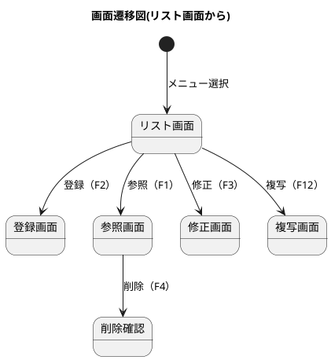
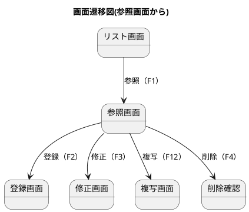
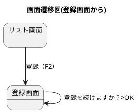

商品や得意先などのマスタ情報を登録する方法です。 ここでは商品マスタを例にして説明しますが、どのマスタも基本的な操作は同様です。

## 画面遷移図(リスト画面から)
リスト画面からの画面遷移図です。参照・登録・修正・複写の各画面に遷移できます。

### リスト画面
登録済みのマスタ情報を一覧表示します。 一覧の表示項目は、各マスタによって異なります。CSVやExcelに出力することができます。

### 参照画面
登録済みのマスタ情報を参照します。 参照画面は、登録画面と同じ画面です。修正ができないようになっています。
前後や先頭末尾のレコードを参照することができます。削除ができるようになっています。

### 登録画面
新規にマスタ情報を登録します。 登録画面は、参照画面と同じ画面ですが、削除ができないようになっています。

### 修正画面
登録済みのマスタ情報を修正します。 修正画面は、参照画面と同じ画面ですが、削除ができないようになっています。

### 複写画面
登録済みのマスタ情報を複写し新規に登録します。 複写画面は、参照画面と同じ画面ですが、削除ができないようになっています。

## 画面遷移図(参照画面から)
参照画面からの画面遷移図です。登録・修正・複写・削除の各画面に遷移できます。

## 画面遷移図（連続登録）
登録画面からの画面遷移図です。確定後に連続登録ができます。
修正や複写、削除の場合も同様です。

## コード検索
登録や修正の際に、コードを入力する場合は、コード検索を利用することができます。
コード検索は、コードの入力欄にカーソルを合わせて、F5キーを押すことで表示されます。
