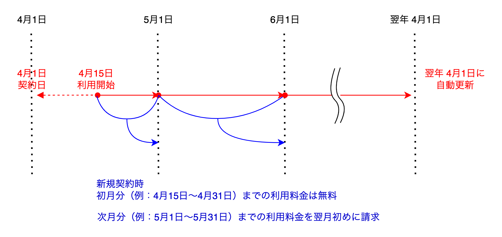
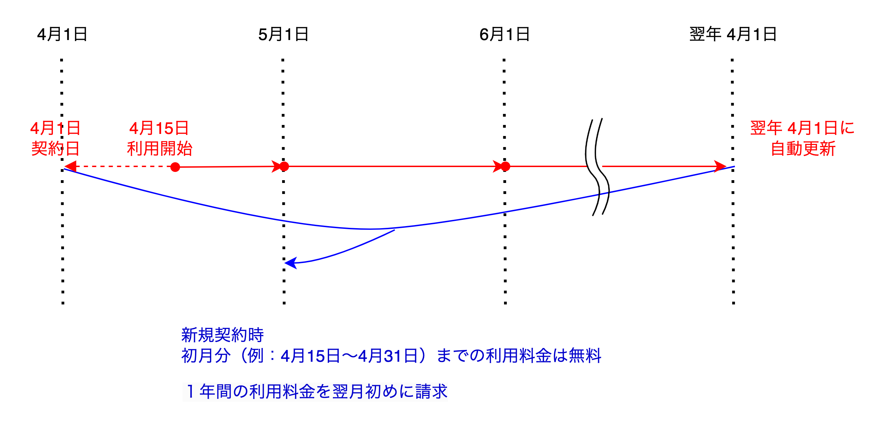

### 契約期間について
 - 契約期間は1年となります。
 - 利用開始月の1日が契約日となります。
 - 初月分は無料となります。
 - 無料期間を除く契約期間中の解約はできません。
 - 契約終了日の30日前までに通知がない場合、契約が自動更新されます（12ヵ月）

### 決済のタイミングについて（月々払いの場合）
 - 契約した月の翌月初めに、前月利用分の請求書を発行します。
 - 請求書発行後、当月以内にお支払いください。

### 決済のタイミングについて（一括払いの場合）
 - 契約した月の翌月月初に、１年間利用分の請求書を発行します。
 - 請求書発行後、当月以内にお支払いください。
